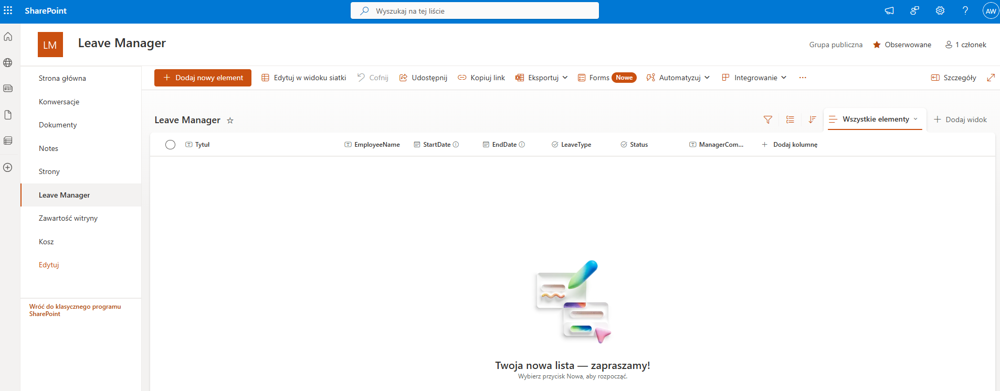

# 📅 SharePoint Leave Manager

## 🇵🇱 Opis projektu

System do zarządzania wnioskami urlopowymi pracowników, zbudowany w oparciu o Microsoft 365: SharePoint Online i Power Automate. Projekt pokazuje działającą strukturę listy, automatyzację zatwierdzania oraz plan dalszego rozwoju z użyciem Power Platform.

### 📋 SharePoint list

Lista `LeaveRequests` zawiera dane wniosków urlopowych pracowników:

- `EmployeeName` – imię i nazwisko
- `StartDate` / `EndDate` – daty urlopu
- `LeaveType` – typ wniosku (Vacation, Sick itd.)
- `Status` – bieżący status (Pending, Approved, Rejected)
- `ManagerComments` – pole na uwagi menedżera

📸 Podgląd:

### 🔧 Funkcjonalności v1.0
- Lista SharePoint `LeaveRequests` zawierająca zgłoszenia urlopowe
- Pola: `EmployeeName`, `StartDate`, `EndDate`, `LeaveType`, `Status`, `ManagerComments`
- Power Automate flow: powiadomienie mailowe + przyciski Zatwierdź/Odrzuć
- Screenshoty i opis działania
- Gotowość do rozszerzenia projektu w Power Apps

---

### 📂 Struktura plików

- `sharepoint/list-schema.md` – opis struktury listy SharePoint
- `docs/flow-description.md` – logika i kroki automatyzacji Power Automate
- `screenshots/list-view.png` – zrzut ekranu z utworzoną listą SharePoint

---

### 🛣️ Roadmapa
- [ ] Formularz Power Apps do zgłaszania urlopów
- [ ] Widok “Moje wnioski” z filtrem użytkownika
- [ ] Dashboard z licznikami i filtrami (Power BI / SharePoint)
- [ ] Integracja z Microsoft Teams (np. alerty)
- [ ] Eksport danych do CSV
- [ ] Import historycznych wniosków z pliku Excel (np. migracja z systemu legacy)

---

## 🇬🇧 Project Description

A lightweight proof-of-concept leave request management system built with Microsoft 365: SharePoint Online and Power Automate. The project includes a working list, automation logic, and a clear roadmap for Power Platform integration.

---

### 🔧 Features v1.0
- SharePoint list `LeaveRequests` with custom fields
- Fields: `EmployeeName`, `StartDate`, `EndDate`, `LeaveType`, `Status`, `ManagerComments`
- Power Automate flow: approval email with Approve/Reject actions
- Screenshots and documentation
- Ready to be extended with Power Apps

---

### 📂 File structure

- `sharepoint/list-schema.md` – SharePoint list structure
- `docs/flow-description.md` – Power Automate flow steps
- `screenshots/list-view.png` – screenshot of the SharePoint list

---

### 🛣️ Roadmap
- [ ] Power Apps form for submitting leave requests
- [ ] "My leave requests" filtered view
- [ ] Dashboard with KPIs and filters (Power BI or SharePoint)
- [ ] Microsoft Teams alert integration
- [ ] CSV export functionality

---

📌 **Note**: Project built and tested using Microsoft 365 trial tenant. Designed to be production-ready after authentication and permission enhancements.
