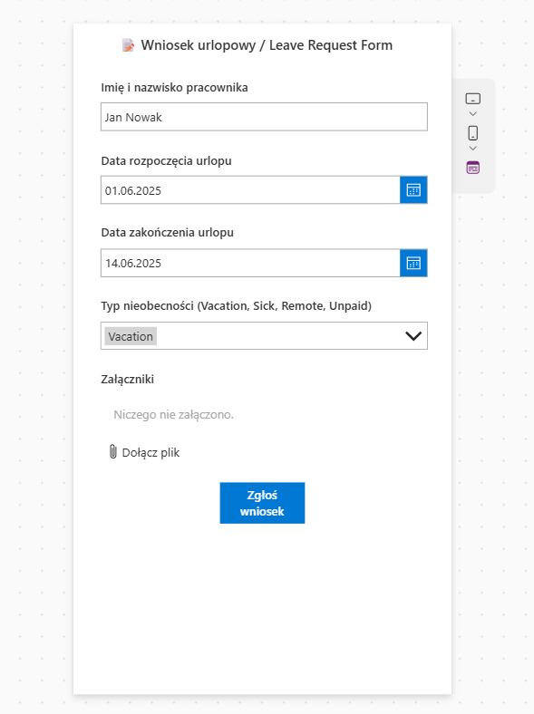
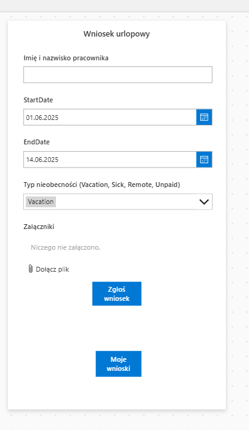
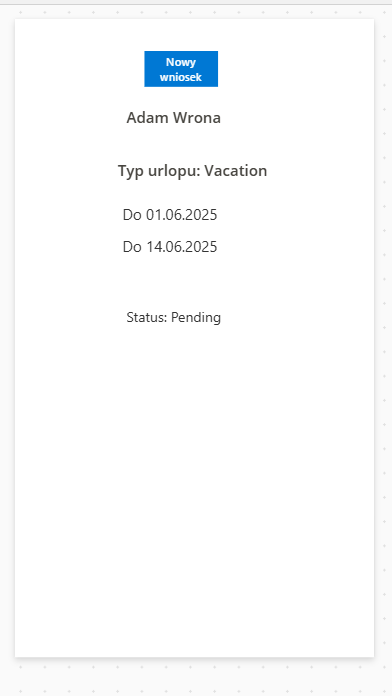

# 📅 SharePoint Leave Manager

## 🇵🇱 Opis projektu

System do zarządzania wnioskami urlopowymi pracowników, zbudowany w oparciu o Microsoft 365: SharePoint Online, Power Automate oraz Power Apps. Projekt demonstruje pełny przepływ — od zgłoszenia nieobecności po automatyzację zatwierdzeń. Dodatkowo zawiera plan dalszego rozwoju z użyciem Power Platform i Microsoft Teams.

---

### 📋 Lista SharePoint – `LeaveRequests`

Zawiera dane wniosków urlopowych pracowników:

- `EmployeeName` – imię i nazwisko pracownika
- `StartDate` / `EndDate` – daty rozpoczęcia i zakończenia urlopu
- `LeaveType` – typ nieobecności (Vacation, Sick, Remote, Unpaid)
- `Status` – status zgłoszenia (Pending, Approved, Rejected)
- `ManagerComments` – komentarz osoby zatwierdzającej

📸 Podgląd listy:

---

### 📝 Formularz Power Apps

Użytkownik może przesłać wniosek o urlop, wypełniając wymagane pola i wybierając typ nieobecności:

### 👤 Widok „Moje wnioski” + nawigacja

Użytkownik może przeglądać tylko własne zgłoszenia urlopowe (na podstawie `EmployeeName = User().FullName`), w formie przejrzystej galerii.  
Dostępna jest intuicyjna nawigacja między formularzem a listą wniosków:

- Przycisk „Moje wnioski” prowadzi do galerii
- Przycisk „Nowy wniosek” wraca do formularza

### 🔧 Funkcjonalności v1.0

- SharePoint list `LeaveRequests` z niestandardowymi polami
- Power Apps formularz zgłoszeniowy (mock)
- Power Automate Flow:
  - Trigger: `When an item is created`
  - Akcja: wysyłka maila z przyciskami `Approve`/`Reject`
  - Aktualizacja statusu + komentarz menedżera
- Dokumentacja plików + screenshoty
- Gotowość do dalszej integracji (Teams, Power BI)

---

### 📂 Struktura plików

📁 sharepoint/
└─ list-schema.md # Struktura listy SharePoint
📁 docs/
└─ flow-description.md # Opis flow zatwierdzania
📁 screenshots/
├─ list-view.png # Widok listy SharePoint
└─ form-submit-clean.png # Widok formularza Power Apps

---

### 🛣️ Roadmapa

+ [x] Formularz Power Apps do zgłaszania urlopów
+ [x] Widok „Moje wnioski” z filtrem użytkownika
- [ ] Dashboard z licznikami i filtrami (Power BI / SharePoint)
- [ ] Integracja z Microsoft Teams (np. powiadomienia)
- [ ] Eksport danych do CSV
- [ ] Import historycznych wniosków z pliku Excel (np. migracja z systemu legacy)
- [ ] Walidacja: dni robocze, święta (Outlook Calendar / Azure Function)

---

## 🇬🇧 Project Description

A lightweight leave request system built with Microsoft 365 tools: SharePoint Online, Power Automate, and Power Apps (mock version). The solution simulates a real approval workflow and is ready for further development (Teams, BI dashboards, data migration, etc.).

---

### 🔧 Features v1.0

- SharePoint list `LeaveRequests` with custom fields
- Power Apps form for submitting requests
- Power Apps gallery showing only requests for the logged-in user
- Power Automate approval flow (email + condition logic)
- Status auto-update + optional manager comment
- Screenshot-based documentation
- Ready for Power Platform and Teams integrations

---

### 🛣️ Roadmap

+ [x] Power Apps form (submit request)
+ [x] "My leave requests" view (user filter)
- [ ] Power BI dashboard or SharePoint view with KPIs
- [ ] Teams alert integration
- [ ] CSV export + Excel import (migration case)
- [ ] Holiday logic validation (e.g. Outlook or Azure Function)

---

📌 **Note**: This is a mock version due to Microsoft 365 Developer sandbox limitations. Easily transferable to a production tenant with working permissions and real data.
